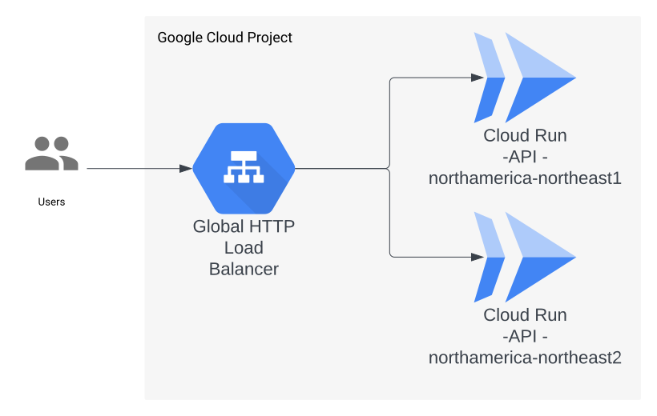

# Google Cloud Recipe - Cloud Run Service - Hello, World!

A [Hello, World!](https://en.wikipedia.org/wiki/%22Hello,_World!%22_program) [Express](https://expressjs.com/) web application served from [Cloud Run](https://cloud.google.com/run/docs/overview/what-is-cloud-run#services), behind a [Regional External Application Load Balancer](https://cloud.google.com/load-balancing/docs/https). This recipe aims to comply with [data residency](https://en.wikipedia.org/wiki/Data_localization) requirements.

Provisioned with [terraform](https://www.terraform.io/).

## Architecture



## Components

### API

#### Endpoints

##### `GET /`

##### Responses

###### 200 OK

```json
{
  "message": "Hello, World!"
}
```

## Deployment

1. Make sure to own a [Domain Name](https://en.wikipedia.org/wiki/Domain_name) or have access to it's DNS configuration. You will need to create an [A record](https://support.google.com/a/answer/2576578?hl=en#zippy=%2Cconfigure-a-records-now) to set up HTTPS at the end of the deployment.
1. Have an [SSL certificate](https://www.cloudflare.com/en-ca/learning/ssl/what-is-an-ssl-certificate/) or generate a [self-signed one](https://www.ibm.com/docs/en/api-connect/2018.x?topic=overview-generating-self-signed-certificate-using-openssl) (for testing purposes).
1. [Install terraform](https://developer.hashicorp.com/terraform/downloads).
1. [Install the gcloud CLI](https://cloud.google.com/sdk/docs/install).
1. [Create a Google Cloud project](https://cloud.google.com/resource-manager/docs/creating-managing-projects#creating_a_project).
1. Run [`gcloud auth login`](https://cloud.google.com/sdk/gcloud/reference/auth/login).
1. Run [`gcloud config set project <your Google Cloud Project ID>`](https://cloud.google.com/sdk/gcloud/reference/config/set).
1. Run [`gcloud auth application-default login`](https://cloud.google.com/sdk/gcloud/reference/auth/application-default/login).
1. `cd` into the [`terraform` folder](./infra/deployment/terraform/)
1. Run `cp terraform.tfvars.template terraform.tfvars` and fill out the variables with your own values.
1. Comment out the contents of the `backend.tf` file.
1. Run `terraform init`.
1. Run `terraform apply -target=module.enable_apis`.
1. Run `terraform apply -target=module.iam`.
1. Run `terraform apply`.
1. Use the `regional_external_application_load_balancer_ip_address` output value to [Configure DNS records on your domain](https://cloud.google.com/run/docs/multiple-regions#dns-config).

### (Optional) Use GCS backend for the terraform state.

1. Uncomment the contents of the `backend.tf` and set the `bucket` attribute to the value of the `terraform_tfstate_bucket` output.
1. Run `terraform init` and type `yes`.

## Testing the API

1. Run `curl https://<your domain name>` (or `curl -k https://<your domain name>` if you used a self-signed certificate). You should see the response `{"message":"Hello, World!"}`.
1. If it returns an error such as `curl: (35) LibreSSL/3.3.6: error:1404B410:SSL routines:ST_CONNECT:sslv3 alert handshake failure` then wait a few minutes and try again.
